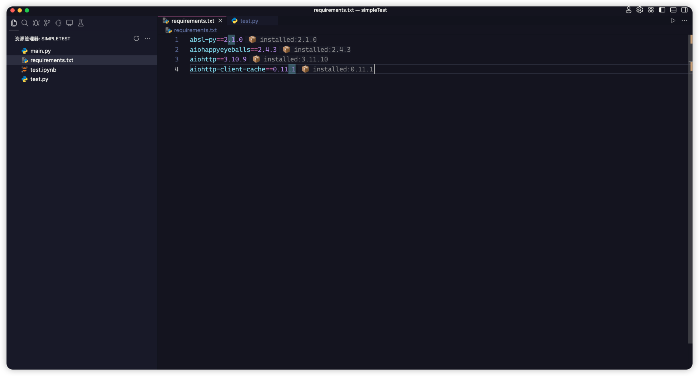
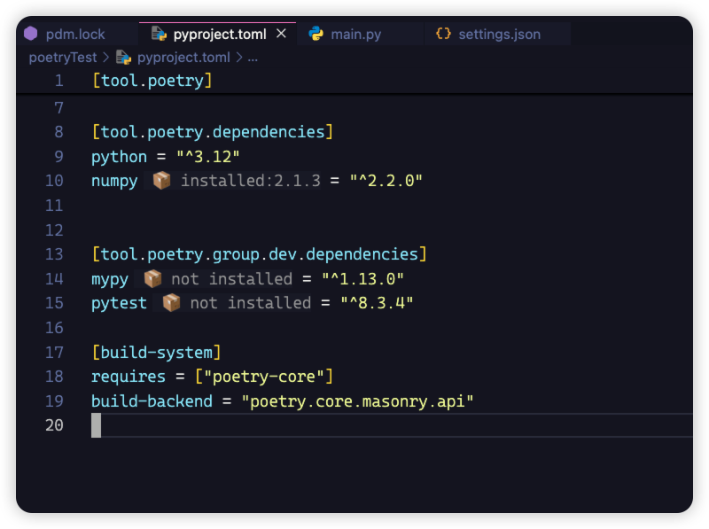

# Python Dep Vesion

this is a vscode extensions for python project development and add inlay hint for all the dependencies module, it can be used in simple python project(dependencies usually writeen in `requirements.txt`) or other python project management tools like `poetry`, `pdm`, `uv`(dependencies usually writeen in `pyproject.toml`).

after install this extension, dependencies inlay hint could be shown as blow:

`requirements.txt` :

`pyproject.toml` :

it also support `uv` and `poetry` format dependencies in `pyproject.toml`, and it also support `Pipfile` format dependencies in `Pipfile`

# Usage

1. install this extension

2. open any python file in vscode

3. select interpreter via command `Python: Select Interpreter`

4. open your `requirments.txt` or `pyproject.toml` file, you will see the inlay hints

here is the commands for this extension:

| command | description |
| --- | --- |
| `python-dep-version.refresh` | force to refresh inlay hints |
| `python-dep-version.clearCache` | clear all inlay hints cache |

# Notice

* any changes to the `requirements.txt` or `pyproject.toml` file will refresh the inlay hints
* change for interpreter also trigger refresh
* but if you install or uninstall packages in terminal, you need to refresh the inlay hints via `python-dep-version.refresh`

# License

Licensed under MIT
